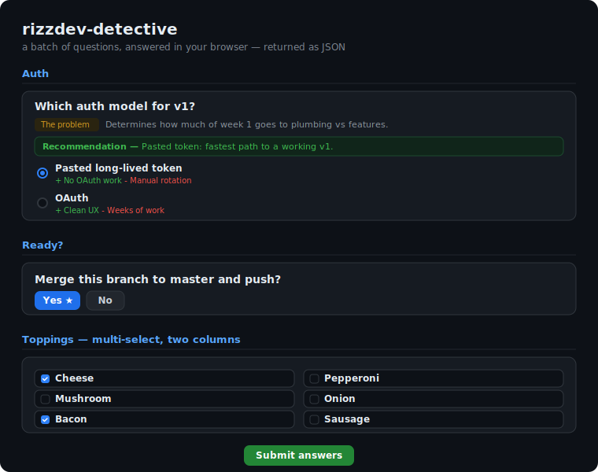

<div align="center">

# 🕵️ rizzdev-detective

### Stop answering AI questions one at a time.

**A [Claude Code](https://claude.com/claude-code) skill that hands you a whole batch of multiple‑choice questions in a slick local web form — with pros, cons, and a recommendation on every option — then reads your answers back as structured JSON.**

<br/>

[](https://github.com/rizzdev/rizzdev-detective/actions/workflows/ci.yml)
[](LICENSE)


<br/>

<video src="https://github.com/rizzdev/rizzdev-detective/raw/main/assets/demo.mp4" controls muted autoplay loop playsinline width="720">
  
</video>

<sub><a href="https://github.com/rizzdev/rizzdev-detective/blob/main/assets/demo.mp4">▶ watch the demo</a> · or run <code>npx github:rizzdev/rizzdev-detective --demo</code></sub>

</div>

---

## Why

When Claude needs a bunch of decisions from you — auth model, data shape, which features to cut — it usually drips them out **one question per message**. That's slow, and you can't see the whole picture at once.

`rizzdev-detective` flips it: Claude writes the *entire* question set, spins up a tiny local web page, and you triage everything in one pass — **radio buttons, checkboxes, yes/no pills, "other" boxes** — with the trade‑offs of each option laid out in front of you. Hit **Submit** and the answers land back in Claude as clean JSON.

No account, no cloud, no dependencies. One file of Node, localhost only.

## ✨ Features

| | |
|---|---|
| 🗂️ **Whole batch at once** | One scrollable form, grouped into sections — answer in any order. |
| ⚖️ **Trade‑offs on every option** | Each choice can show a 👍 **pro** and 👎 **con** line. |
| 💡 **A recommendation per question** | Claude marks its suggested pick and says *why*. |
| ❓ **"The problem" context** | Each question can explain what the answer unblocks. |
| 🔬 **Research‑first + cited findings** | With `--deep`/`--online`, Claude investigates first and shows a **findings** briefing panel with clickable sources; recommendations cite `file:line` and links. |
| 📡 **Live adaptive interviews** | `--live` keeps one tab open and **streams new questions in as you answer** — branch on your choices, revise a past answer and it re‑asks downstream. |
| 🔘 **Every input type** | Single‑select, multi‑select, and compact **yes/no pills**. |
| 🧮 **Smart long lists** | ~15 short options auto‑flow into **two columns** to stay compact. |
| ✍️ **Always an escape hatch** | Per‑question **"Other"** box + a global **"anything else?"** field. |
| 🎨 **Terminal / CLI aesthetic** | Monospace, a shell‑prompt header, `@clack`‑style `◇` step gutter, `○/◉` radios and `[ ]/[×]` checkboxes, a sticky `⏎ submit` bar. |
| 📦 **Zero dependencies** | Pure Node built‑ins. One `.mjs` file. Localhost only. |
| 🔌 **Skill or CLI** | Use it as a Claude Code skill, or run it standalone. |

## ⚡ Try it in 5 seconds

No install, no config — run the built-in demo straight from GitHub (needs Node ≥ 22):

```sh
npx github:rizzdev/rizzdev-detective --demo
```

It opens a sample interview in your browser — findings panel, pros/cons, yes/no pills, drag-to-rank, keyboard nav. Then point it at your own questions:

```sh
npx github:rizzdev/rizzdev-detective questions.json --out results.json
```

## 🚀 Install (as a Claude Code skill)

```sh
git clone https://github.com/rizzdev/rizzdev-detective.git
cd rizzdev-detective

# Linux / macOS / WSL
./install.sh

# Windows (PowerShell)
.\install.ps1
```

The install script symlinks this folder into `~/.claude/skills/rizzdev-detective`, so a `git pull` keeps it current on every machine. Restart Claude Code (or run `/reload-skills`) and you're set.

> Override the destination with the `CLAUDE_SKILLS_DIR` env var.

## 🗣️ Using it

Just ask Claude for a lot of questions, or run the command:

```
/rizzdev-detective
```

Claude will author the questions, open the form in your browser, and wait. You answer, submit, and it continues with your choices. That's the whole loop.

**When it kicks in:** you ask for "a lot of questions", a questionnaire, or a survey — or run `/rizzdev-detective`.
**When it won't:** a single quick question (Claude just asks in chat).

## 🧩 Authoring questions (the schema)

Claude writes a JSON file and runs the server against it. The shape:

```json
{
  "title": "Optional page heading",
  "sections": [
    {
      "title": "Auth",
      "questions": [
        {
          "id": "auth",
          "text": "Which auth model for v1?",
          "why": "Determines how much of week 1 goes to plumbing vs features.",
          "type": "single",
          "recommendation": { "optionId": "token", "why": "Fastest path to a working v1." },
          "options": [
            { "id": "token", "label": "Pasted long-lived token", "pro": "No OAuth work", "con": "Manual rotation" },
            { "id": "oauth", "label": "OAuth", "pro": "Clean UX", "con": "Weeks of work" }
          ],
          "allowOther": true
        },
        {
          "id": "merge",
          "text": "Merge to master and push?",
          "type": "yesno",
          "recommendation": { "optionId": "yes", "why": "It's the repo's normal sync flow." }
        }
      ]
    }
  ]
}
```

**Question types**

| `type` | Renders as | Notes |
|---|---|---|
| `single` *(default)* | Radio list | Pick one. Long, short, pro/con‑free lists auto‑flow to two columns. |
| `multi` | Checkbox list | Pick any number. Same two‑column behavior. |
| `yesno` | Compact Yes/No pills | `options` optional (auto Yes/No, or override for custom two‑choice labels). `allowOther` defaults off. |

**Fields** — `id` (unique), `text`, `why?`, `type?`, `recommendation?` (`{optionId?, why?}`), `options` (`{id, label, pro?, con?}`), `allowOther?` (defaults on for single/multi). Top level takes a `title?`, an optional **`findings?`** research briefing (`{ summary, sources: [{ label, ref }] }` — URL refs link, `file:line` refs get tagged), plus either `sections` or a flat `questions` array.

## 📤 What comes back

On submit, the server prints JSON to stdout (and to `--out <file>` if given):

```json
{
  "answers": {
    "auth":  { "selected": ["token"], "other": "" },
    "merge": { "selected": ["yes"],   "other": "" }
  },
  "globalNote": "any overall notes",
  "submittedAt": "2026-07-01T13:05:00.000Z"
}
```

`selected` holds the chosen option `id`s (0–1 for single/yesno, 0–n for multi). `other` is the per‑question text box; `globalNote` is the end‑of‑form field. Unanswered questions come back with an empty `selected` — partial submissions are fine.

## 🖥️ Standalone CLI

No Claude required — it's just Node:

```sh
node detective.mjs questions.json --out results.json
# or straight from GitHub, no clone:
npx github:rizzdev/rizzdev-detective questions.json --out results.json
npx github:rizzdev/rizzdev-detective --demo   # built-in sample
```

It picks a free port, opens your browser (falls back to printing the URL), blocks until you submit, then writes/prints the results and exits.

## 📡 Live mode — adaptive interviews

For decision trees that branch on your answers, Claude can run a **live interview**: one open tab, questions streaming in as you go.

```sh
detective.mjs --live --out transcript.json   # persistent server (SSE)
detective.mjs push <batch.json>              # inject a question batch
detective.mjs wait                           # block until the user answers
detective.mjs retract --from <batchId>       # drop stale downstream batches
detective.mjs finish --out transcript.json   # end + print the transcript
```

Claude pushes a batch, waits for your answers, then pushes the next questions **branched on what you said**. Change your mind on an earlier answer and it **retracts + re‑asks** everything downstream. Still zero dependencies (SSE over the built‑in `http`), still localhost‑only.

## ⚙️ How it works

```
Claude writes questions.json
        │
        ▼
node detective.mjs questions.json     ──►  serves a one-page form on 127.0.0.1
        │                                   (auto-opens your browser)
        ▼
you answer + Submit  ──►  POST /submit  ──►  results printed as JSON, server exits
        │
        ▼
Claude reads the answers and continues
```

One run = one interview. It's stateless, localhost‑only, and never phones home.

## 🧪 Development

```sh
node --test        # 31 unit + integration tests, zero deps
```

The code is one file (`detective.mjs`) with small, independently‑tested pieces: `loadQuestions` (validate + normalize), `renderPage` / `renderBatchHtml`, `normalizeResults`, and the one‑shot `serve` + persistent `serveLive` servers. See [`docs/DESIGN.md`](docs/DESIGN.md) for the original design and [`docs/PLAN.md`](docs/PLAN.md) for the build plan.

## 📄 License

[MIT](LICENSE) © rizzdev

<div align="center"><sub>Built with <a href="https://claude.com/claude-code">Claude Code</a>.</sub></div>
